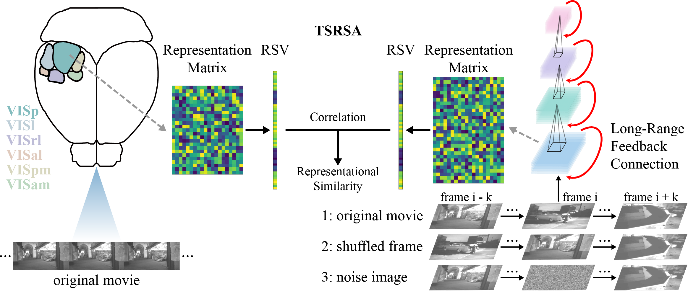

# SNN-Neural-Similarity-Movie

Official implementation of "[Long-Range Feedback Spiking Network Captures Dynamic and Static Representations of the Visual Cortex under Movie Stimuli](https://openreview.net/forum?id=bxDok3uaK6)" (**NeurIPS2024**). See [preprint](https://arxiv.org/abs/2306.01354).

By Liwei Huang, Zhengyu Ma, Liutao Yu, Huihui Zhou, Yonghong Tian.

We propose the long-range feedback spiking network (**LoRaFB-SNet**), which mimics top-down connections between cortical regions and incorporates spike information processing mechanisms inherent to biological neurons. We present Time-Series Representational Similarity Analysis (**TSRSA**) to measure the similarity between model representations and visual cortical representations of mice. Through evaluation, LoRaFB-SNet is highly competent in capturing both dynamic and static representations of the mouse visual cortex and contributes to the understanding of movie processing mechanisms of the visual system.



## Requirements

In order to run this project you will need:

- Python3
- PyTorch>=1.5.0, please refer to [https://pytorch.org/get-started/previous-versions/](https://pytorch.org/get-started/previous-versions/)
- SpikingJelly
```
pip install spikingjelly==0.0.0.0.14
```
- The following packages: numpy, tqdm, scikit-learn

## Model Training

The code is stored in the file folder `train`. It supports single GPU or multiple GPUs.

Train on the ImageNet:

```
python train_imagenet.py --epochs 320 --batch-size 32 --opt sgd --lr 0.1 --lr-scheduler cosa --lr-warmup-epochs 5 --lr-warmup-decay 0.01 --amp --model-name lorafb_snet18 --T 4 --output-path logs/
```

Train on the UCF101:

```
python train_video.py --dataset UCF101 --frames 16 --f-steps 16 --epochs 100 --batch-size 32 --opt sgd --lr 0.1 --lr-scheduler cosa --lr-warmup-epochs 10 --lr-warmup-decay 0.001 --amp --model-name lorafb_snet18 --output-path logs/
```

The checkpoints of all pretrained models in the paper are available at [https://drive.google.com/drive/folders/1o9PtoLEYdXkZytMprWsSITYjEDGMSZaT?usp=sharing](https://drive.google.com/drive/folders/1o9PtoLEYdXkZytMprWsSITYjEDGMSZaT?usp=sharing).

## Time-Series Representational Similarity

The code is stored in the file folder `similarity`.

The experiments are performed on a subset of the [Allen Brain Observatory Visual Coding dataset](https://allensdk.readthedocs.io/en/latest/visual_coding_neuropixels.html), which includes two visual stimuli (*Movie1* and *Movie2*). For data preprocessing, please see the official implementation of the public dataset and the introduction of the paper.

The preprocessed neural data are available at [https://drive.google.com/drive/folders/1zJcN-kFxoPwyVT5RPEhKDpo60r7PBPem?usp=sharing](https://drive.google.com/drive/folders/1zJcN-kFxoPwyVT5RPEhKDpo60r7PBPem?usp=sharing) and the preprocessed visual stimuli are available at [https://drive.google.com/drive/folders/1MNCWc5FIvcibx6BmFPicVk_0pJEJbFQT?usp=sharing](https://drive.google.com/drive/folders/1MNCWc5FIvcibx6BmFPicVk_0pJEJbFQT?usp=sharing).

Test on the original movie:

```
python similarity.py --model lorafb_snet18 --train-dataset ucf101 --checkpoint-path model_checkpoint/ucf101/lorafb_snet18.pth --neural-dataset allen_natural_movie_one --neural-dataset-dir neural_dataset/ --metric TSRSA --stimulus-dir stimulus/ --output-dir results/
```

Test on the original movie with different movie clip lengths:

```
python similarity.py --model lorafb_snet18 --train-dataset ucf101 --checkpoint-path model_checkpoint/ucf101/lorafb_snet18.pth --neural-dataset allen_natural_movie_one --neural-dataset-dir neural_dataset/ --metric TSRSA --stimulus-dir stimulus/ --output-dir results/ --trial-for-clip 10 --clip-len 300
```

Test on the shuffled movie:

```
python similarity.py --model lorafb_snet18 --train-dataset ucf101 --checkpoint-path model_checkpoint/ucf101/lorafb_snet18.pth --neural-dataset allen_natural_movie_one --neural-dataset-dir neural_dataset/ --metric TSRSA --stimulus-dir stimulus/ --output-dir results/ --trial-for-ablation 10 --shuffle --window 300 --best-layer
```

Test on the movie with replaced frames:

```
python similarity.py --model lorafb_snet18 --train-dataset ucf101 --checkpoint-path model_checkpoint/ucf101/lorafb_snet18.pth --neural-dataset allen_natural_movie_one --neural-dataset-dir neural_dataset/ --metric TSRSA --stimulus-dir stimulus/ --output-dir results/ --trial-for-ablation 10 --replace --replace-type gaussian --window 5 --best-layer
```

## Citation

If you find our work is useful for your research, please kindly cite our paper:

```
@misc{huang2024longrangefeedbackspikingnetwork,
      title={Long-Range Feedback Spiking Network Captures Dynamic and Static Representations of the Visual Cortex under Movie Stimuli}, 
      author={Liwei Huang and Zhengyu Ma and Liutao Yu and Huihui Zhou and Yonghong Tian},
      year={2024},
      eprint={2306.01354},
      archivePrefix={arXiv},
      primaryClass={cs.NE},
      url={https://arxiv.org/abs/2306.01354}, 
}
```